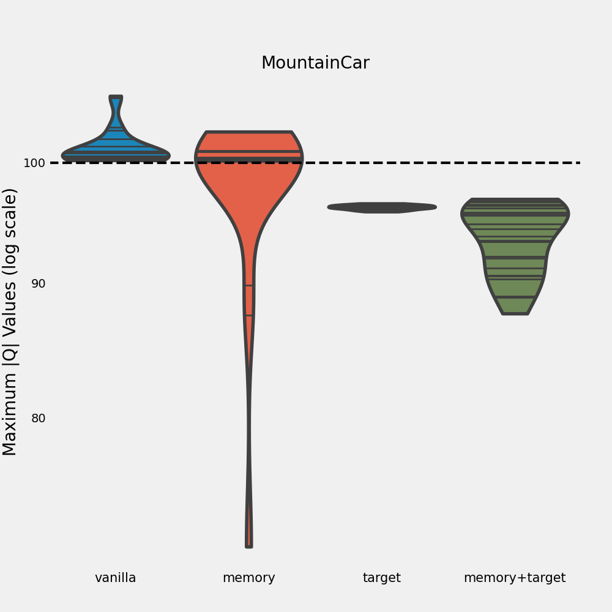
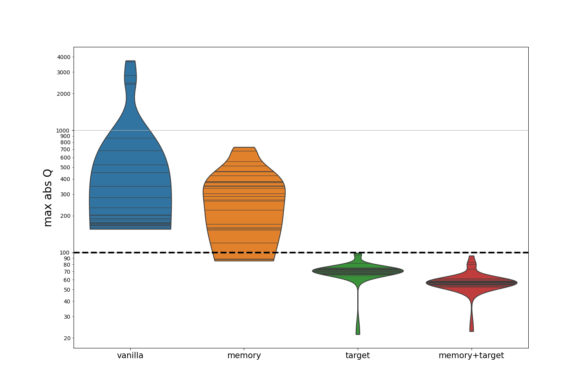
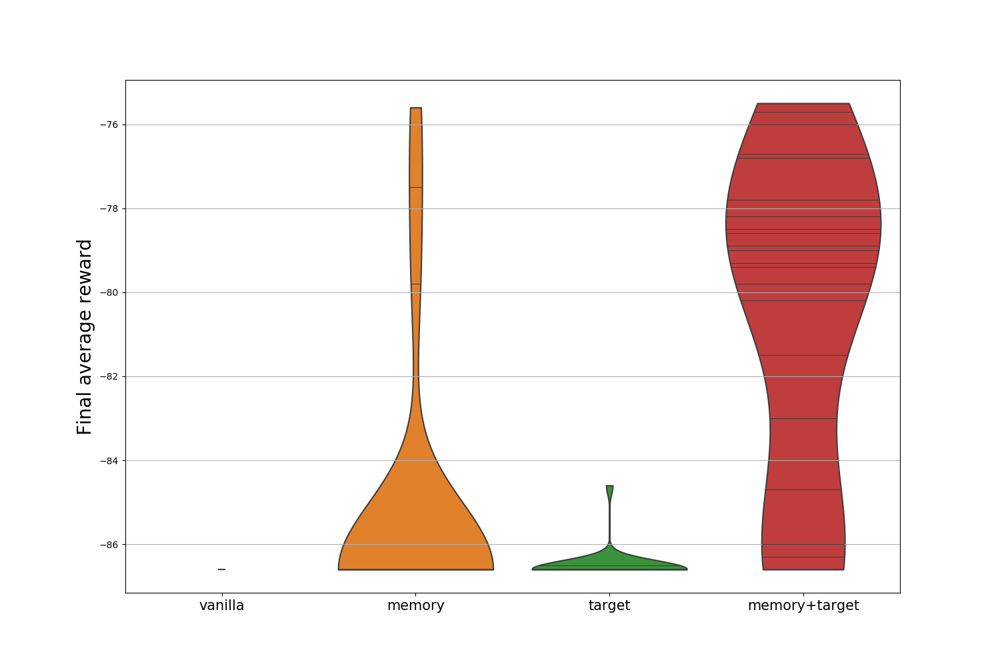
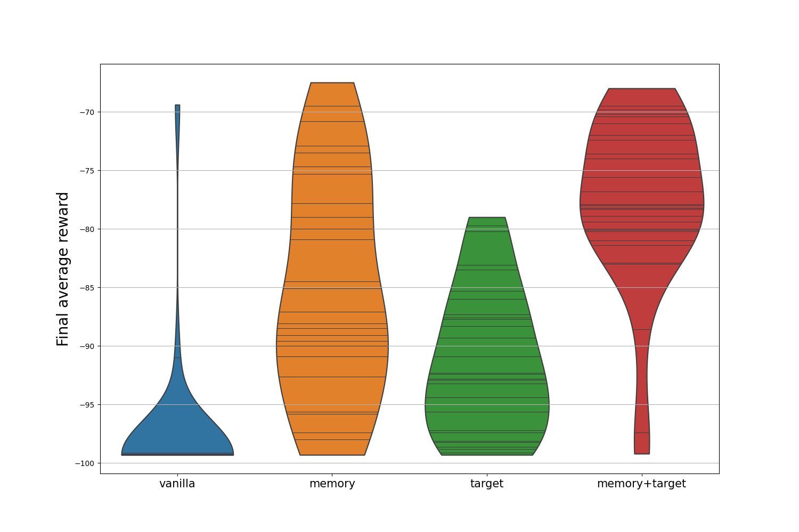
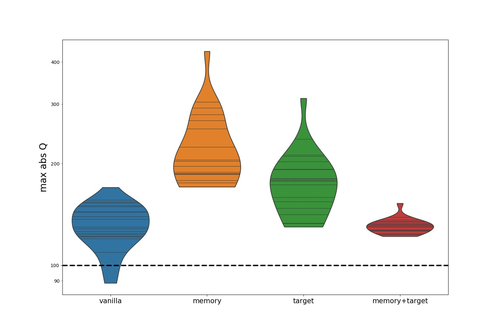

Deep Q Networks (DQN) revolutionized the Reinforcement Learning world. It was the first algorithm able to learn a successful strategy in a complex environment immediately from high-dimensional image inputs. In this blog post, we investigate how some of the techniques introduced in the original paper contributed to its success. Specifically, we investigate to what extent **memory replay** and **target networks** help prevent **divergence** in the learning process. 

<!--more-->

Reinforcement Learning (RL) has already been around for a while, but it is not even close to being solved yet. While *supervised learning* can already be quite difficult, RL methods also need to deal with changes in the data distribution, huge state spaces, partial observability, and various other issues. In 2013, the paper [Playing Atari with Deep Reinforcement Learning (Mnih et al.)](https://www.cs.toronto.edu/~vmnih/docs/dqn.pdf) introduces **DQN, the first RL method to successfully learn good policies directly from high-dimensional inputs using neural networks**. The algorithm performs better than human experts in several Atari games, learning directly from image input.

<!---  -->
{{ page.img_dir }}{{ "space_invaders_games_2.png" }} 

Screenshots from three Atari 2600 Games: (Left-to-right) Pong, Breakout, and Space Invaders.
 


DQN introduces several techniques to stabilize the learning process. In this post, we take a look at two of them, **memory replay** and **target networks**. We run our own experiments, investigating to what degree each of the techniques in this process. This in turn gives us better insight into the learning dynamics of Q-learning with neural network function approximation. This is important, as a better understanding of these learning dynamics allows us to focus further research on the most promising methods (and other things?).

The rest of this post is outlined as follows:
- We first develop a little bit of the **background**, briefly going into RL, Q-Learning, function approximation with neural networks, and the DQN algorithm.
- We then give a definition of **divergence**, which we use in our experiments.
- We describe the **experimental setup**,
- after which we **discuss** the results.

<!--- - While RL has been around for a while, first time shown to work well with high-dimensional sensory input in 2013 (or 2015) by DQN paper.
- they did this by successfully playing multiple Atari games using the same learning framework, even beating human expert players in some of them.
- function approximation with neural networks had been around for a while, but never succeeded
- DQN introduced some tricks that helped: Experience replay memory, and target networks
- In this blog post, we explore to what extent each of the techniques introduced by DQN contributed to its success
- Specifically, we investigate to what extent each of the techniques avoid divergence in the learning process.
- This in turn gives us insight into the learning dynamics of Q-learning with neural network function approximation. A better understanding of these learning dynamics allows us to focus research on the most promising methods and give us insight into the more important aspects of learning. -->

## Background

In this post, we will just give a brief overview of the main techniques, and not go too deep into all the background theory. If you want to dig deeper, we suggest checking out [the original paper](https://www.cs.toronto.edu/~vmnih/docs/dqn.pdf).

### Reinforcement Learning
<!--- - 2 or 3 sentences about RL in general
In Reinforcement Learning (RL), an agent learns to take good actions by optimizing a scalar reward given by its environment. The agent learns to map the current state of the world to a probability distribution over its actions, which we call a policy. -->

In RL, we study an **agent** interacting with some **environment**. The agent learns to take good actions by optimizing a **scalar reward** given by its environment. The agent learns to map the current state of the world, $$s$$, to a probability distribution over its actions $$\pi(a \mid s)$$, which we call a policy. In an Atari game, the game is the environment, and the player is the agent who is trying to maximize their score by learning a good policy.

The environment provides us with a reward signal at every point in time. We care about getting the maximum cumulative reward over time, the **return**. At any timestep $$t$$, we can define the future return as:

$$
\begin{align*}
G_{t} :=\ &r_t + \gamma r_{t+1} + \ldots + \gamma^{T - t}r_T = \sum_{t'=t}^T \gamma^{t'-t}r_{t'}\\
       =\ &r_t + \gamma G_{t + 1}, & (1)
\end{align*}
$$

where $$r_t$$ is the reward at time $$t$$, $$T$$ is the time-step where the **episode** terminates, and $$0 \leq \gamma \leq 1$$ is the **discount rate**. The discount rate is used to control how much we care about future rewards. An episode can be seen as one instance of learning. In the Atari world, an episode is one round of playing before a game over. Equation 1 provides us with a very important identity for learning later on.

Since we don't know what rewards we are going to get in the future, we have to work with the **expected** future (discounted) return. This leads us to $$Q$$-values, defined as the expected future return, given that we take action $$a$$ in state $$s$$ and follow policy $$\pi$$ afterwards:

$$
Q^\pi(s, a) := \mathbb{E}_\pi[G_t \mid S_t = s, A_t = a].
$$

The expectation is with respect to $$\pi$$, since it determines (along with the environment) which states are visited, and in turn which rewards are obtained.

### $$Q$$-Learning

If we can learn these $$Q$$-values, we know which actions yield the best returns, allowing us to optimize our policy. One technique based on this principle is **$$Q$$-Learning**. In $$Q$$-learning, we learn the optimal $$Q$$-values directly from experienced environment transitions $$(s, a, r, s')$$, where $$s'$$ is the state following $$s$$. The following update rule is used:

$$
Q(s, a) \leftarrow Q(s, a) + \alpha (r + \gamma \max_{a'} Q(s', a') - Q(s, a)),
$$

where $$\alpha$$ is a learning rate parameter controlling learning speed. The sample transitions can be generated using *any* policy, such as an [epsilon-greedy policy](https://link), making $$Q$$-learning an **off-policy** method.

However, this assumes we can store all the $$Q$$-values for each state-action pair in a table. In most realistic scenarios such as playing Atari games, this **tabular** approach is not possible. It is therefore usually necessary to **approximate** the $$Q$$-values.

In DQN, the update is a little bit different, since it uses function approximation with parameters $$\theta$$, i.e. $$Q(s,a) = Q(s, a; \theta)$$. It is equivalent (footnote here: not truly equivalent) to minimizing the mean squared error between $$r + \gamma \max_{a'} Q(s', a')$$ and the current $$Q$$-value using stochastic gradient descent:

$$
\begin{align*}
\theta^{t+1} &\leftarrow \theta^t -
\\
&\alpha [(r + \gamma \max_{a'} Q(s', a'; \theta^t) - Q(s, a; \theta^t)) \nabla_{\theta^t} Q(s, a; \theta^t)], & (2)
\end{align*}
$$

<!--- - q learning
    - definitions return, q-learning objective -->

### Function Approximation

Imagine mapping an Atari game state to a $$Q$$-value directly from image data. Assuming RGB pixel values and an 84x84 pixel screen, we would need to store $$(256 \cdot 3)^{84\cdot84}$$ values, one for each pixel configuration. Besides this impracticality, we would also not generalize well between different pixel states, as these do not capture latent structure efficiently.

Therefore, **function approximation** is used to predict $$Q$$-values using some learned function, given a state or state-action pair. This allows $$Q$$-values to be represented in a compressed form (the parameters) and generalization over similar states. For a long time, linear models were the go-to function approximator, since they are theoretically relatively straightforward to study. However, these models are in many cases too simple to accurately capture complex system dynamics. A next obvious option was using **neural networks**. However, while neural networks can learn very complex dynamics, they are also notoriously unstable.

This instability prevented neural networks from being used successfully in RL for quite some time. That is, until DQN proposed several techniques to combat this instability, including **experience replay** and **target networks**.

### Experience Replay

We've seen that DQN learns $$Q$$-values using neural networks. This can be seen as supervised learning. In this paradigm, a key assumption is that data is independently and identically distributed (iid). In RL however, this does not hold. Subsequent states are highly correlated, and the data distribution changes as the agent learns. To deal with this, DQN saves the last $$N$$ experienced transitions in memory with some finite capacity $$N$$. When performing a $$Q$$-value update, it uses experiences randomly sampled from memory.

The idea of sampling randomly is to **break the correlation** between updated experiences, increasing sample efficiency and reducing variance. The authors also argue that the technique: helps by avoiding unwanted feedback loops; and averages the behavior distribution over many previous states, smoothing out learning and avoiding divergence.

### Target Networks

In the parameter update given by Equation 2, the Q network predicts both the current state's predicted $$Q$$-value, as well as the **target**: $$r + \gamma \max_{a'} Q(s', a'; \theta^t)$$. However, after the parameters of the network are updated, the target value changes as well. This is like asking the network to learn to throw a bull's eye, but then moving the dart board somewhere else. This leads to instability.

To tackle this problem, DQN proposes using a **target network**. The idea is to compute the target using a (target) network that is not updated for some amount of time-steps. That way, the targets don't "move" during training. Every $$C$$ time-steps, the target network is synchronized with the current $$Q$$ network.

<!--- - function approximation
- neural networks
- dqn's
  - what is different about dqn's
    - way of modelling
        - stack last 4 frames
    - most importantly: 2 techniques
        - experience replay
          - store samples in memory and sample.
          - Why? Break correlations. ML methods require iid data.
        - target networks
            - one network stays fixed for some period of time, this is the target network
            - why? this stabilizes learning -->

## Divergence

One of our goals was to find out to what extent the two techniques above help dealing with divergence in the learning process. When learning diverges, we are not able to learn properly. Every state-action value is assumed to exist and be finite. If the algorithm doesn't converge, it means we are not in a local or global optimum.

For most environments, we don't know the true Q-values. How do we know when divergence occurs then? [Van Hasselt et al.](http://arxiv.org/abs/1812.02648) use a clever trick to define **soft divergence**. To avoid instability, DQN clips all rewards to the range $$[-1, 1]$$. Thus, the future return at some state is bounded by:

$$
\sum_{t'=t}^T \gamma^{t'-t}|r_{t'}| \leq \sum_{t'=t}^\infty \gamma^{t'-t}|r_{t'}| \leq \sum_{t'=t}^\infty \gamma^{t'-t} = \frac{1}{1-\gamma}, (3)
$$

where the last equality is a general result for geometric series. This means that any $$Q$$-value is theoretically bounded by (3). Thus, if the maximum absolute $$Q$$-value exceeds this bound, we say that soft divergence occurs.

<!--- - goal of this blog post is to find out to what extent each of these techniques help to deal with divergence
- if the networks diverge, we are most likely not learning anything meaningful.
- Every state-action value is assumed to exist and be finite. If the algo doesn't converge, it means we are not in
  a local or global optimum.
- Defining divergence
    - For most environments, we don't know the true Q-values. How do we know when divergence occurs then?
    - intuition: if some state-action pairs get assigned unrealistically high values, we say there is **soft divergence**.
    - when are values too high? Show discount_factor / max q value calculation.
    - reward clipping -->

## Experimental setup

We are now able to quantify divergence, which gives us a straightforward way to compare different algorithms in terms of divergence. We run each setup X times, and report the fraction of runs at which soft divergence occurs. We set the amount of runs to ?? to ensure statistically significant results, while taking our computational budget into account.

We try to make sure our experimental setup coincides with the DQN implementation as much as possible. Due to computational constraints, we unfortunately can't run any experiments on Atari games. Instead, we investigate the following simpler environments: Cart-Pole, Mountain Car, Inverse Pendulum, ... . We want enough environments such that we have divergence and convergence on each setup. 

We use the following hyperparameter settings in all our experiments:
- We use an epsilon-greedy exploration strategy, where epsilon is linearly annealed over ?? steps to 0.05, after which it stays at that level.
- Learning rate $$\alpha = x$$
- Adam optimizer
- reward clipping to range [-1, 1]
- gradient clipping to x
- discount factor x

<!--- - Evaluating the different techniques
    - how we evaluate the techniques
      - run each setup for X runs
      - measure the fraction of times that soft divergence occurs
      - we do this by tracking the max absolute q value. If this is larger than X, we say divergence occurs
      - we do this for ? runs, because ??
      - the less divergence occurs, the more we say a technique helps avoiding divergence
    - explanation on environments
        - we need to do many runs to get some statistically significant results
        - we don't have the time and resources to investigate computationally expensive atari games
        - therefore, we investigate environments that are relatively simple and computationally inexpensive
        - we want enough environments such that we have divergence and convergence on each setup
    - the following hyperparameters are important
      - optimizer type
      - learning rate
      - discount factor
      - reward clipping
      - gradient clipping
      - ...
      - we try to stick to the original paper as much as possible -->

## Results and Discussion

After identifying the best hyper-parameters for each of our environments, we
looked at their divergence in four setups: with all tricks disabled, with
memory sampling, having a target network, and by having both tricks enabled.
Our results for MountainCar and Acrobot are shown below

On the y-axis we see a the $$\max |Q|$$ on a logarithmic scale.
The dashed line represents our theoretical maximal $$|Q|$$, above which we deem
the network to have diverged.
We see that with these environments, memory sampling has a limited effect on
slowing down divergence, whereas employing a separate target network is more
effective.
We also observe that when having both tricks,the network's divergence is slowed
down even more.

Based on all our experiments we can say that divergence with DQN is
unavoidable, however it can be slowed down, allowing the network to learn more,
and achieve a higher score.
We can see this in the following plots, which show us the distribution of
obtained rewards.

In the case of having both memory sampling and a target network enabled, we
achieved the highest reward.
However, the graphs also tell us that although the target network is more
effective at slowing down divergence, it also negatively influences DQN's
learning capabilities.

// TOOD: maybe think of a theoretical explanation of this?

Lastly, we look at our results on the CartPole environment, for which we
explicitly disabled the error clipping.
Mnih et. al. argued that this improved the stability of the neural network,
however based on our findings, we can say that it also significantly reduced
the network's learning capacity (and the reward obtained).

// TODO: add reward image of CartPole.

We see that error clipping is instrumental to making the tricks work.
Without error clipping, the tricks actually hasten the divergence, rather than
slow it down.

## Conclusions

With this article we looked at DQN's stability and how memory sampling and a
separate target network help prevent divergence.
We came to the conclusion that both tricks are in fact necessary and that
without them the network is likely to spiral out of control within a
(relatively) short amount of episodes.
The target network trick proved to be more effective in slowing divergence, but
it caused less optimal parameters to be learned.
Combining the two tricks gave us the best results.

We also looked at the effects of clipping the error term during training, and
understood that netither of tricks is useful without the clipping.

**Footnotes**
