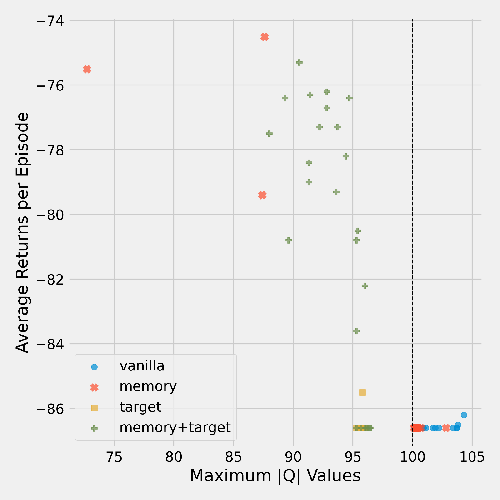
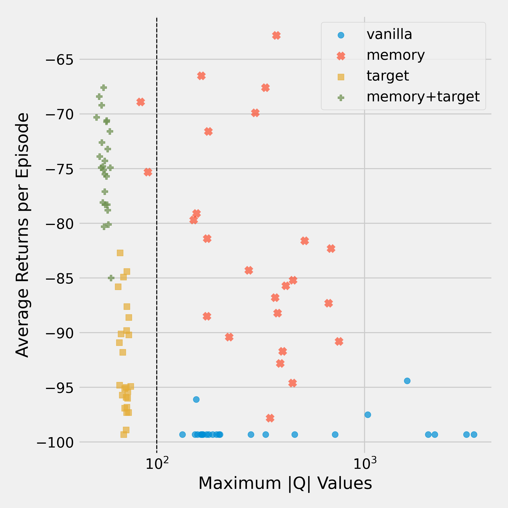
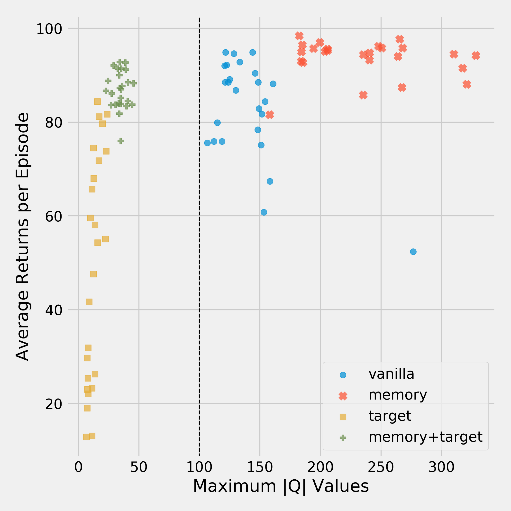

*By [Emil Dudev](https://github.com/edudev/), [Aman Hussain](https://github.com/AmanDaVinci), [Omar Elbaghdadi](https://omarelb.github.io), and [Ivan Bardarov](https://www.linkedin.com/in/ivan-bardarov).*

Deep Q Networks (DQN) revolutionized the Reinforcement Learning world. It was the first algorithm able to learn a successful strategy in a complex environment immediately from high-dimensional image inputs. In this blog post, we investigate how some of the techniques introduced in the original paper contributed to its success. Specifically, we investigate to what extent **memory replay** and **target networks** help prevent **divergence** in the learning process. 

<!--more-->

Reinforcement Learning (RL) has already been around for a while, but it is not even close to being solved yet. While *supervised learning* can already be quite difficult, RL methods also need to deal with changes in the data distribution, huge state spaces, partial observability, and various other challenges. In 2013, the paper [Playing Atari with Deep Reinforcement Learning (Mnih et al.)](https://www.cs.toronto.edu/~vmnih/docs/dqn.pdf) introduces **DQN, the first RL method to successfully learn good policies directly from high-dimensional inputs using neural networks**. The algorithm performs better than human experts in several Atari games, learning directly from image input.

<!---  -->
{{ page.img_dir }}{{ "space_invaders_games_2.png" }} 

Screenshots from three Atari 2600 Games: (Left-to-right) Pong, Breakout, and Space Invaders.
 


The DQN authors improve on DQN in their [2015 paper](https://storage.googleapis.com/deepmind-media/dqn/DQNNaturePaper.pdf), introducing additional techniques to stabilize the learning process. In this post, we take a look at the two key innovations of DQN, **memory replay** and **target networks**. We run our own experiments, investigating to what degree each of these techniques helps avoid **divergence** in the learning process. When divergence occurs, the quality of the learned strategy has a high chance of being destroyed, which we want to avoid. Studying the conditions of divergence also allows us to get a better insight into the learning dynamics of $$Q$$-learning with neural network function approximation.

The rest of this post is outlined as follows:
- We first develop a little bit of the **background**, briefly going into RL, $$Q$$-learning, function approximation with neural networks, and the DQN algorithm.
- We then give a definition of **divergence**, which we use in our experiments.
- We describe the **experimental setup**,
- after which we **discuss** the results.

<!--- - While RL has been around for a while, first time shown to work well with high-dimensional sensory input in 2013 (or 2015) by DQN paper.
- they did this by successfully playing multiple Atari games using the same learning framework, even beating human expert players in some of them.
- function approximation with neural networks had been around for a while, but never succeeded
- DQN introduced some tricks that helped: Experience replay memory, and target networks
- In this blog post, we explore to what extent each of the techniques introduced by DQN contributed to its success
- Specifically, we investigate to what extent each of the techniques avoid divergence in the learning process.
- This in turn gives us insight into the learning dynamics of Q-learning with neural network function approximation. A better understanding of these learning dynamics allows us to focus research on the most promising methods and give us insight into the more important aspects of learning. -->

## Background

In this post, we will just give a brief overview of the main techniques, and not go too deep into all the background theory. If you want to dig deeper, we suggest checking out [the original paper](https://www.cs.toronto.edu/~vmnih/docs/dqn.pdf).

### Reinforcement Learning
<!--- - 2 or 3 sentences about RL in general
In Reinforcement Learning (RL), an agent learns to take good actions by optimizing a scalar reward given by its environment. The agent learns to map the current state of the world to a probability distribution over its actions, which we call a policy. -->

In RL, we study an **agent** interacting with some **environment**. The agent learns to take good actions by optimizing a **scalar reward** given by its environment. The agent learns to map the current state of the world, $$s$$, to a probability distribution over its actions $$\pi(a \mid s)$$, which we call a **policy**. In an Atari game, the game is the environment, and the player is the agent who is trying to maximize their score by learning a good policy.

The environment provides us with a reward signal at every point in time. We care about getting the maximum cumulative reward over time, the **return**. At any timestep $$t$$, we can define the future return as:
$$
\begin{align}
G_{t} :=\ &r_t + \gamma r_{t+1} + \ldots + \gamma^{T - t}r_T = \sum_{t'=t}^T \gamma^{t'-t}r_{t'}\\
       =\ &r_t + \gamma G_{t + 1}, & (1)
\end{align}
$$

where $$r_t$$ is the reward at time $$t$$, $$T$$ is the time-step where the **episode** terminates, and $$0 \leq \gamma \leq 1$$ is the **discount rate**. The discount rate is used to control how much we care about future rewards, with higher values looking farther into the future. An episode can be seen as one instance of learning. In the Atari world, an episode is one round of playing before a game over. Equation 1 provides us with a very important identity for learning later on.

Since we don't know what rewards we are going to get in the future, we have to work with the **expected** future (discounted) return. This leads us to $$Q$$-values, defined as the expected future return, given that we take action $$a$$ in state $$s$$ and follow policy $$\pi$$ afterwards:

$$
Q^\pi(s, a) := \mathbb{E}_\pi[G_t \mid S_t = s, A_t = a].
$$

The expectation is with respect to $$\pi$$, since it determines (along with the environment) which states are visited, and in turn which rewards are obtained.

### Q-Learning

If we can learn these $$Q$$-values, we know which actions yield the best returns, allowing us to optimize our policy. One technique based on this principle is **$$Q$$-Learning**. In $$Q$$-learning, we learn the optimal $$Q$$-values directly from experienced environment transitions $$(s, a, r, s')$$, where $$s'$$ is the state following $$s$$ after taking action $$a$$. The following update rule is used:

$$
Q(s, a) \leftarrow Q(s, a) + \alpha (r + \gamma \max_{a'} Q(s', a') - Q(s, a)), (2)
$$

where $$\alpha$$ is a learning rate parameter controlling learning speed. This update pushes the current $$Q$$-values $$Q(s, a)$$ towards their **bootstrap targets** $$r + \gamma \max_{a'}Q(s', a')$$. The sample transitions can be generated using *any* policy, such as an [epsilon-greedy policy](https://medium.com/analytics-vidhya/the-epsilon-greedy-algorithm-for-reinforcement-learning-5fe6f96dc870), making $$Q$$-learning an [**off-policy**](https://stats.stackexchange.com/questions/184657/what-is-the-difference-between-off-policy-and-on-policy-learning) method.

<!--- In most realistic scenarios such as playing Atari games, we can't store $$Q$$-values for every possible state, as the state space is too large. It is therefore usually necessary to **approximate** the $$Q$$-values. -->

<!--- - q learning
    - definitions return, q-learning objective -->

### Function Approximation

In most realistic scenarios, the state space is too large to store $$Q$$-values for. Imagine mapping an Atari game state to a $$Q$$-value directly from image data. Assuming RGB pixel values and an 84x84 pixel screen, we would need to store $$(256 \cdot 3)^{84\cdot84}$$ values, one for each pixel configuration. Besides this impracticality, we would also not generalize well between different pixel states, as these do not capture latent structure efficiently.

Therefore, **function approximation** is used to predict $$Q$$-values using some learned function, given a state or state-action pair. This allows $$Q$$-values to be represented in a compressed form (the parameters) and generalization over similar states.

In DQN, the $$Q$$ update is a little bit different than described in Equation 2, since it uses function approximation with parameters $$\theta$$, i.e. $$Q(s,a) = Q(s, a; \theta)$$. It is roughly equivalent[^semi-gradient] to minimizing the mean squared error between the target $$r + \gamma \max_{a'} Q(s', a')$$ and the current $$Q$$-value using [stochastic gradient descent](https://towardsdatascience.com/stochastic-gradient-descent-clearly-explained-53d239905d31):

[^semi-gradient]: The true gradient contains an extra term, and usually does not work very well. Instead, semi-gradient methods, which don't backpropagate through the target Q function $$Q(s', \cdot)$$, are usually found to work better.

$$
\begin{align*}
\theta^{t+1} &\leftarrow \theta^t +
\\
&\alpha [(r + \gamma \max_{a'} Q(s', a'; \theta^t) - Q(s, a; \theta^t)) \nabla_{\theta^t} Q(s, a; \theta^t)], & (3)
\end{align*}
$$

where $$Q$$ is implemented as a neural network. While neural networks can learn very complex dynamics, they are also notoriously unstable. This instability prevented neural networks (and other complex function approximators) from being used successfully in RL for quite some time. That is, until DQN proposed several techniques to combat this instability, including **experience replay** and **target networks**.

<!--- For a long time, linear models were the go-to function approximator, since they are theoretically relatively straightforward to study. However, these models are in many cases too simple to accurately capture complex system dynamics. A next obvious option was using **neural networks**. -->

### Experience Replay

We've seen that DQN learns $$Q$$-values using neural networks. This can be seen as supervised learning. In this paradigm, a key assumption is that data is independently and identically distributed (i.i.d.). In RL, however, this does not hold. Subsequent states are highly correlated, and the data distribution changes as the agent learns. To deal with this, DQN saves the last $$N$$ experienced transitions in memory with some finite capacity $$N$$. When performing a $$Q$$-value update, it uses experiences randomly sampled from memory.

The idea of sampling randomly is to **break the correlation** between updated experiences, increasing sample efficiency and reducing variance. The authors also argue that the technique: helps by avoiding unwanted feedback loops; and averages the behavior distribution over many previous states, smoothing out learning and avoiding divergence.

### Target Networks

In the parameter update given by Equation 3, the Q network predicts both the current state's predicted $$Q$$-value, as well as the **target**: $$r + \gamma \max_{a'} Q(s', a'; \theta^t)$$. However, after the parameters of the network are updated, the target value changes as well. This is like asking the network to learn to throw a bull's eye, but then moving the dart board somewhere else. This leads to instability.

To tackle this problem, DQN proposes using a **target network**. The idea is to compute the target using a (target) network that is not updated for some amount of time-steps. That way, the targets don't "move" during training. Every $$C$$ time-steps, the target network is synchronized with the current $$Q$$ network.

<!--- - function approximation
- neural networks
- dqn's
  - what is different about dqn's
    - way of modelling
        - stack last 4 frames
    - most importantly: 2 techniques
        - experience replay
          - store samples in memory and sample.
          - Why? Break correlations. ML methods require iid data.
        - target networks
            - one network stays fixed for some period of time, this is the target network
            - why? this stabilizes learning -->

## Divergence

Our goal is to find out to what extent the two techniques mentioned above help dealing with divergence in the learning process. Divergence occurs when the $$Q$$-function approximator learns unrealistically high values for state-action pairs, in turn destroying the quality of the greedy control policy derived from $$Q$$ [(Van Hasselt et al.)](http://arxiv.org/abs/1812.02648).

For most environments, we don't know the true Q-values. How do we know when divergence occurs then? [Van Hasselt et al.](http://arxiv.org/abs/1812.02648) use a clever trick to define **soft divergence**, a proxy for divergence. To avoid instability, DQN clips all rewards to the range $$[-1, 1]$$. Thus, the future return at some state is bounded by:

$$
\sum_{t'=t}^T \gamma^{t'-t}|r_{t'}| \leq \sum_{t'=t}^\infty \gamma^{t'-t}|r_{t'}| \leq \sum_{t'=t}^\infty \gamma^{t'-t} = \frac{1}{1-\gamma}, (4)
$$

where the last equality is a general result for geometric series. This means that any $$Q$$-value is theoretically bounded by (4). **If the maximum absolute $$Q$$-value exceeds this bound, we say that soft divergence occurs.**

<!--- - goal of this blog post is to find out to what extent each of these techniques help to deal with divergence
- if the networks diverge, we are most likely not learning anything meaningful.
- Every state-action value is assumed to exist and be finite. If the algo doesn't converge, it means we are not in
  a local or global optimum.
- Defining divergence
    - For most environments, we don't know the true Q-values. How do we know when divergence occurs then?
    - intuition: if some state-action pairs get assigned unrealistically high values, we say there is **soft divergence**.
    - when are values too high? Show discount_factor / max q value calculation.
    - reward clipping -->

## Experimental setup

We try to follow the experimental setup of the [DQN paper](https://www.cs.toronto.edu/~vmnih/docs/dqn.pdf) wherever possible. Even though the authors use a convolutional neural network to play Atari games, we limit ourselves to a simpler architecture given our computation and time constraints. We use a **fully-connected** neural network with **a single hidden layer (excluding input and output layers) of size 128**, mapping from input states to a discrete set of actions. We use **ReLU** activation functions at each layer before the output layer.

Given our constraints, we only look at relatively simple, computationally inexpensive environments. **We explore three environments**, so that our results are not specific to any one of them. Each environment is chosen to be of a different (estimated) difficulty, as we consider this an important distinction in our context. We consider classical control theory environments made available by [OpenAI gym](https://gym.openai.com/envs/#classic_control):

### Environment 1: [Cart Pole](https://gym.openai.com/envs/CartPole-v1/)

In the Cart Pole environment, the agent tries to balance a pole on a cart by applying a rightward or a leftward force. For every time step the pole remains upright (less than 15 degrees from vertical), the agent receives a reward of +1. Since his problem is considered relatively easy to solve. we chose it as a representative of problems with low difficulty.

### Environment 2: [Acrobot](https://gym.openai.com/envs/Acrobot-v1/)

In the Acrobot environment, the agent tries to swing up a two-link robot arm above the base by applying a clockwise or anti-clockwise torque. This problem is considered more difficult than the previous one, so we select it as a representative of problems with mid-level difficulty.

### Environment 3: [Mountain Car](https://gym.openai.com/envs/MountainCar-v0/)

In the Mountain Car environment, the agent starts a car at the bottom of a valley and tries to drive it up the right hill. However, the car's engine is not strong enough to do so in a single pass. Instead it has to go back and forth between the left and right hill to build momentum. This problem is quite challenging, so we choose it as a representative of problems with high-level difficulty.

### Experiments and hyperparameters
Since divergence can now be quantified, we use it as a metric to compare which algorithms exhibit more divergence than others. **We say an algorithm exhibits more divergence if the fraction of runs in which soft divergence occurs is higher.** We refer to Memory Replay and Target Networks as DQN's "tricks". The improvement that each of the tricks brings to DQN is measured against the **baseline** model, DQN without tricks, or *vanilla* DQN.
*We thus compare 4 different setups for each environment*: without tricks (vanilla agent), with Memory Replay (memory agent), with target networks (target agent), and with both tricks (DQN / memory+target agent).

We run each experiment with **random seeds from 1 to 25** to achieve more statistically sound results, while taking into account our computational budget. If the maximal absolute Q-value in any of the last 20 training episodes is above the threshold $$\frac{1}{1-\gamma}$$, we say soft divergence occurs. 
<!--- At the end, we compare the configurations by counting how many times each of them has diverged. -->

All the agents are **trained for 700 episodes** which we found to be enough for them to learn to win the games. For better exploration, we use an **$$\epsilon$$-greedy** strategy which is **linearly annealed from 1 to 0.1 during the first 400 episodes**, and kept fixed after. The discount factor is **$$\gamma = 0.99$$** for all the environments.

Another hyperparameter is the **frequency of target network updates** (whenever the technique is used). We empirically find **400, 2000, 2000** to work well for **Mountain Car, Cart Pole and Acrobot respectively**. No extensive hyperparameter search has been done since the focus of our work is not state-of-the-art performance, but to compare the importance of the tricks. The values of **the parameters are selected manually for the configuration with no tricks** and kept fixed for all other configurations of the respective environment.

Similar to the original paper, we use the **mean-squared error (MSE)** loss between the predicted and bootstrap $$Q$$-values. Clipping the loss between $$[-1, 1]$$ has been reported to improve the training stability of DQN. We do this for all environments except Cart Pole, which achieves better results without the clipping. The error is optimized by [Adam](https://arxiv.org/pdf/1412.6980.pdf) with a **learning rate $$\alpha = 0.001$$**. The choice of optimizer deviates from the original paper but has shown great success in deep learning recently. Additional experiments with different values of the learning rate and the contribution of error clipping are left for future work.

*The code used in all our experiments [can be found on Github](https://github.com/VaniOFX/DQN-divergence).*

<!--- - Evaluating the different techniques
    - how we evaluate the techniques
      - run each setup for X runs
      - measure the fraction of times that soft divergence occurs
      - we do this by tracking the max absolute q value. If this is larger than X, we say divergence occurs
      - we do this for ? runs, because ??
      - the less divergence occurs, the more we say a technique helps avoiding divergence
    - explanation on environments
        - we need to do many runs to get some statistically significant results
        - we don't have the time and resources to investigate computationally expensive atari games
        - therefore, we investigate environments that are relatively simple and computationally inexpensive
        - we want enough environments such that we have divergence and convergence on each setup
    - the following hyperparameters are important
      - optimizer type
      - learning rate
      - discount factor
      - reward clipping
      - gradient clipping
      - …
We run each setup X times, and report the fraction of runs at which soft divergence occurs. We set the amount of runs to ?? to ensure statistically significant results, while taking our computational budget into account.

We try to make sure our experimental setup coincides with the DQN implementation as much as possible. Due to computational constraints, we unfortunately can't run any experiments on Atari games. Instead, we investigate the following simpler environments: Cart-Pole, Mountain Car, Inverse Pendulum, ... . We want enough environments such that we have divergence and convergence on each setup. 

We use the following hyperparameter settings in all our experiments:
- We use an epsilon-greedy exploration strategy, where epsilon is linearly annealed over ?? steps to 0.05, after which it stays at that level.
- Learning rate $$\alpha = x$$
- Adam optimizer
- reward clipping to range [-1, 1]
- gradient clipping to x
- discount factor x
      - we try to stick to the original paper as much as possible -->

## Results

Our main results can be summarized by the figures below.
Each figure displays a scatter plot for one environment, where **each point represents one training run**. Each point's x-coordinate is given by its max \|$$Q$$\|, which can be used to identify soft divergence. The y-coordinate shows its average *return* in the last 20 episodes, indicating the performance achieved in that run.
This allows us to analyze the effect of the tricks on divergence and overall performance, as well as how these interact, at the same time.
We first discuss the obtained results for each environment separately, from which we draw more general conclusions.

### Mountain Car

<!--- 

  
  
  

 -->

<!--- TODO: add titles to the plots, identifying the experiment -->

To begin with, let's look at the Mountain Car results below.

The vanilla agent diverges and fails miserably at learning a good policy.
The memory agent also performs badly for most runs, but does learn a good policy for a small amount of runs.
Specifically **for the runs where the memory agent does not diverge, it actually obtains a good overall return.**
This is an interesting observation, as it suggests that our measure of divergence is indeed predictive of final performance for this environment.

The target agent has managed to eliminate divergence completely, but the policy it learns is poor. **Not diverging is clearly not a guarantee for good performance.**
As one would expect, the network with both tricks enabled performs best. 
It does not diverge and consistently achieves high rewards.
However, even the DQN agent has runs on which it doesn't learn anything.
This goes to show that out of the tasks we explore, Mountain Car is relatively difficult.

### Acrobot

We now go over the results for the Acrobot environment. For clarity, we use a log scale for the Q values here.

As with Mountain Car, the vanilla network is the worst out of all configurations here.
Again, it diverges heavily and doesn't learn any meaningful policy.
On the other hand, **we observe that the memory agent manages to find good policies, despite exhibiting soft divergence**. The variance of its return is higher than that of the other methods, indicating that the learning process is not that stable.
**This suggests that the amount of soft divergence, our proxy for divergence, is not fully indicative of how well an algorithm learns.**

We see again that using both tricks alleviates divergence and leads to high returns. If just the target network is used, divergence is again controlled, but the learned policy is still worse than that of using both tricks.

### Cart Pole

The last environment we look at is the Cart Pole environment.

Despite both the vanilla and memory agents exhibiting soft divergence, they still manage to learn good policies. Interestingly, although the memory agent shows the most divergence, it achieves a higher average return than the other settings.

In line with the previous results, having a target network greatly reduces soft divergence. However, its average return is now even lower than that of the vanilla agent.
Once more, using both tricks controls soft divergence and allows learning good policies, but the memory agent does perform better in this case.

### Putting Things into Perspective

So what did we learn from our experiments?
In each of the three environments we explore, the **vanilla agent (soft) diverges every single time.
The target network trick significantly helps in reducing this divergence** as well as the variance of the max |$$Q$$|.
In fact, not a single run diverged when making use of a target network.
**Without the target network, divergence seems almost inevitable.**
This is made especially clear by the below figure, which zooms in on the distributions of the max |$$Q$$| (in log scale). The dotted line indicates the soft divergence threshold.

  
  
  

**For the Acrobot environment, the memory agent is able to learn good policies even when it shows divergence. The same holds for the memory and vanilla agents in the Cart Pole environment.** This contrasts the findings in the Mountain Car environment, where the memory agent only learns a good policy when it doesn't diverge. It appears that divergence has a larger impact on performance for some environments than for others. There are many possible explanations for this, among which:

- We hypothesize that the **difficulty of a task** is an important factor in this process. In the simplest environment, Cart Pole, divergence doesn't seem to be an issue in terms of performance. In the harder environments, however, divergence does seem to affect the quality of the policies. In Acrobot, the variance of the memory agent is very high, and its performance is lower compared to the DQN agent as well. **In the Mountain Car environment, the agent didn't manage to learn anything for every single run that diverged.** It might be that as the task grows more difficult, having accurate Q value estimates becomes more important.
- Another possibility is that our proxy metric for measuring divergence, max \|$$Q$$\|, is too noisy. It is calculated by keeping track over this quantity for each update transition encountered during the last 20 episodes. **Taking the maximum is not robust to outliers**. If a single high value is encountered in one state, while most of the states are well behaved, this may give a very skewed picture of the divergence in training run.

Another important insight is that **adding memory replay improves performance in all our experiments**. The target agent is always improved by adding the memory replay mechanism (resulting in the DQN agent). This corroborates the findings of the original DQN paper, which say that memory replay leads to a better realization of the i.i.d. data assumption, subsequently allowing gradient descent to find a better optimum.

**In short, target networks prevent divergence in the learning process. While memory replay does not prevent divergence, it is an important technique that guides the search towards good policies. Combining both tricks gives us the best of both worlds — a controlled divergence setup with good Q-value estimates.**

## Some Final Remarks

It is always good practice to look critically at obtained results. In this final section, we highlight some **limitations** of our approach:

- Given our constraints on computation and time, we do not do an exhaustive **hyperparameter search** over our 3 chosen environments. We focused on varying the discount factor and target network update frequency, yet even for those we considered only a few values. This means that the observed behavior might be different had we chosen different sets of hyperparameters. Ideally, we would want to average results over more hyperparameter settings.
- Relating to the previous point, we **only use a pretty shallow neural network of 2 layers in all our experiments**. This might cause all methods to have an even harder time learning a difficult task such as the Mountain Car task.
- We evaluate 25 seeds per setup. While this is better than 1, we would ideally want to have more seeds to base conclusions on, given the high variance of reinforcement learning methods.
- We choose to use a proxy for divergence, soft divergence. **Despite this proxy being theoretically well-motivated, it is still a proxy.** We don't know how it relates exactly to "actual" divergence.
- As mentioned in the previous section, our method of metric for soft divergence might no be very robust to outliers. Future studies could look at more robust versions of the metric.

The conclusion that we come to above is not completely unexpected, but the fact that memory replay doesn't prevent divergence is definitely an interesting insight. Thank you for reading!

<!--- We also looked at the effects of clipping the error term during training, and
understood that netither of tricks is useful without the clipping in the simple environments we tested. -->

**Footnotes**